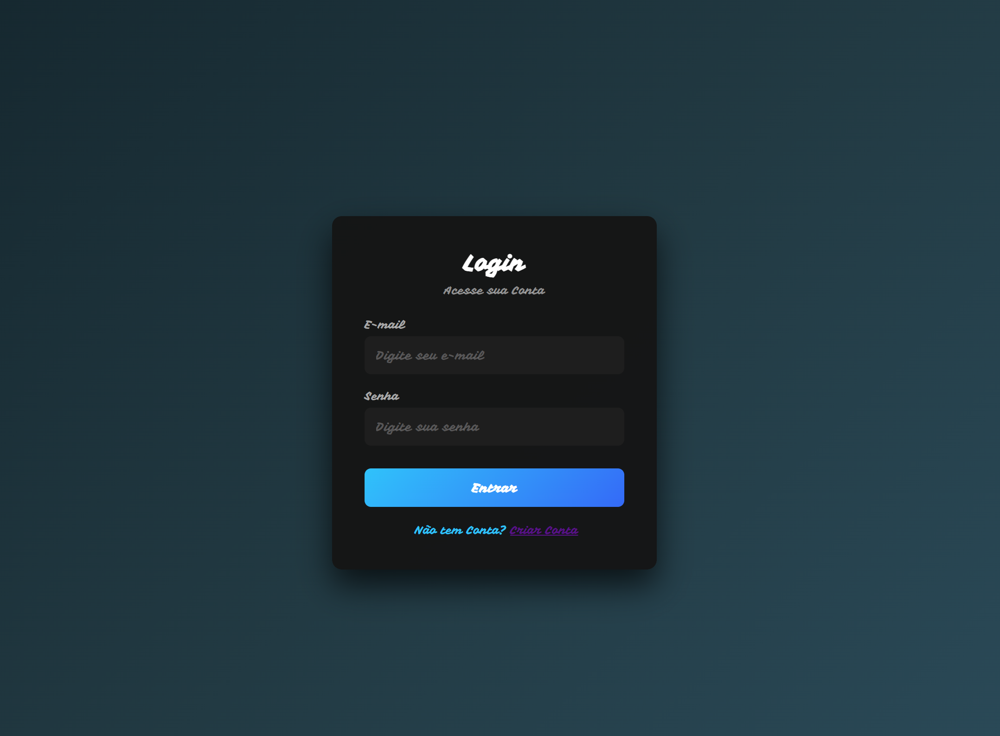
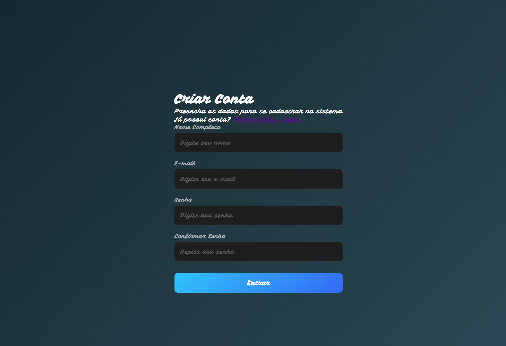
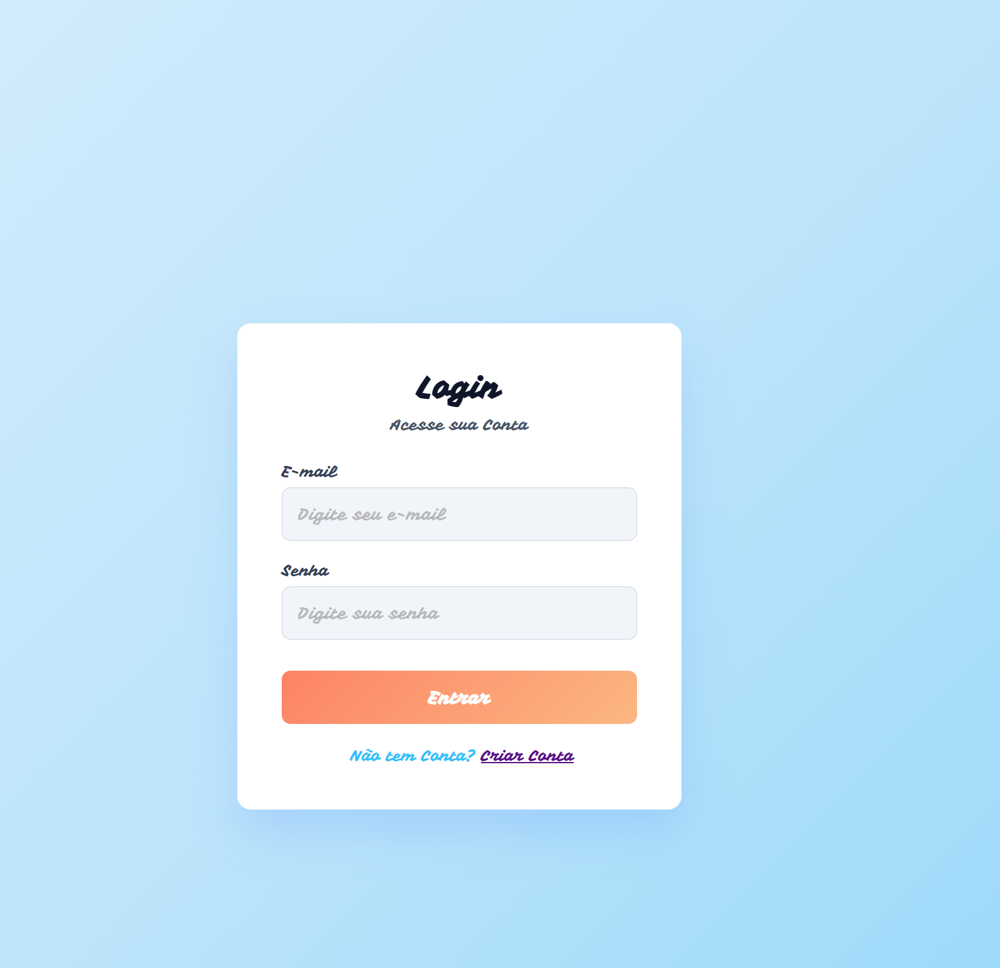
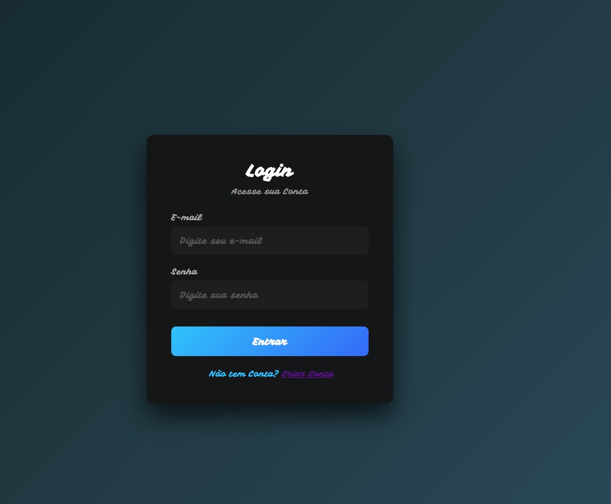

# Projeto Login System

## Sobre o projeto

O Login System é uma aplicação web desenvolvida para demonstrar um sistema de cadastro e autenticação de usuários, utilizando HTML, CSS, JavaScript, Node.js e Express[cite: 6]. 

## Funcionalidades
- Cadastro de usuários[cite: 6]
- Login[cite: 6]
- Validação de formulários[cite: 6]
- Criptografia de senhas[cite: 6]
- Autenticação utilizando JWT[cite: 6]
- Tema claro e escuro[cite: 6]
- Sistema de notificações[cite: 6]
- Modal de mensagens[cite: 6]
- Página protegida[cite: 6]
- API REST[cite: 6]

## Tecnologias

### Front-End
- HTML5[cite: 6]
- CSS3[cite: 6]
- JavaScript[cite: 6]

### Back-End
- Node.js (Ambiente de execução)[cite: 3, 6]
- Express (Criação de rotas com servidor HTTP)[cite: 3, 6]
- bcryptjs (Criptografia das senhas)[cite: 3, 6]
- JSON Web Token (Geração de token de sessão)[cite: 3, 6]
- Mongoose (Modelagem de dados e conexão com banco)[cite: 3, 4]
- dotenv (Gerenciamento de variáveis de ambiente)[cite: 3, 4]
- CORS (Controle de acesso a recursos)
- Nodemon (Reinicialização automática do servidor em ambiente de desenvolvimento)[cite: 3, 4]

## Estrutura do projeto

```text
Login-System/
│
├── frontend/
│   └── index.html
│
├── backend/
│   ├── server.js
│   ├── routes/
│   └── database/
│
├── .gitignore
├── package.json
├── package-lock.json
├── explicação.txt
└── README.md

Como executar

1. Clonar o repositório

Bash

git clone [https://github.com/26leandro/Projeto_Login_Systen.git](https://github.com/26

2. Entrar na pasta

Bash

cd Projeto_Login_Systen

3. Instalar as dependências

Bash

npm install

4. Iniciar o servidor

Para iniciar em modo de produção:

Bash

npm start

Para iniciar em modo de desenvolvimento (utilizando nodemon):

Bash

npm run dev

O servidor estará rodando em http://localhost:3001.

Variáveis de ambiente

Crie um arquivo .env na raiz ou na pasta do backend para conectar com o ambiente. 
O arquivo .gitignore já está configurado para proteger arquivos sensíveis, além de ignorar a pasta node_modules e arquivos .txt.

Exemplo de configuração:

Snippet de código
PORT=3001
JWT_SECRET=sua_chave_secreta_aqui

Como utilizar

- Acesse a página de cadastro.

- Crie um usuário.

- Retorne para a página de login.

- Informe e-mail e senha.

- Realize o login.

- Após a autenticação, acesse a página principal.

- Utilize o botão de alteração de tema para alternar entre modo claro e escuro.

Demonstração visual

Tela de Login: 

Tela de Cadastro: !

Tema Dark / Light: 

Autor

Leandro

Curso Técnico em Ciências de Dados

Escola do Futuro Paulo Renato de Souza

Professor: Heraclides Mourão